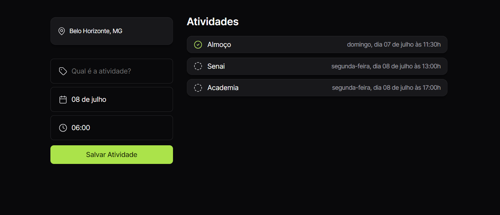

# 🪴Plann.er
<br>

Este projeto é uma to-do list desenvolvida durante a semana de imersão NLW (New Level Week) oferecida pela Rocketseat. O objetivo do projeto é proporcionar uma experiência prática com HTML, CSS e JavaScript, criando uma aplicação simples e funcional para gerenciamento de tarefas.

## Funcionalidades

- **Adicionar Tarefas**: Permite ao usuário adicionar novas tarefas à lista.
- **Marcar como Concluída**: Permite ao usuário marcar tarefas como concluídas.


## Tecnologias Utilizadas

- **HTML**: Estrutura da aplicação.
- **CSS**: Estilização da aplicação.
- **JavaScript**: Funcionalidade e interatividade da aplicação.

## Como Executar o Projeto

1. Clone o repositório para o seu ambiente local:
   ```bash
   git clone https://github.com/eduardavieira-dev/planner-rocketseat.git
   ```

2. Navegue até o diretório do projeto:
   ```bash
   cd planner-rocketseat
   ```

3. Abra o arquivo `index.html` no seu navegador preferido.


## Aprendizados

Durante o desenvolvimento deste projeto, tive a oportunidade de reforçar meus conhecimentos em:

- Manipulação do DOM com JavaScript.
- Uso de eventos em JavaScript.
- Estilização de elementos com CSS.


